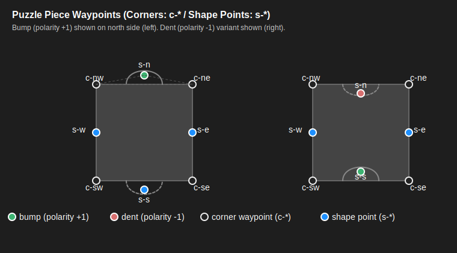

# Puzzle Game - Technical Specification

## Project Overview
**Type**: Browser-based Single Page Application (SPA)
**Mode**: Offline-capable puzzle game
**Target**: MVP with local image upload functionality

## Core Concept
Transform uploaded images into interactive jigsaw puzzles with drag-and-drop gameplay mechanics.

## Technical Requirements

### Platform
- **Frontend**: HTML5, CSS3, JavaScript (ES6+)
- **Canvas**: HTML5 Canvas API for image manipulation and piece rendering
- **Storage**: Local browser storage (no server required)
- **Compatibility**: Modern browsers supporting File API, Canvas, and drag-and-drop

### Core Features

#### 1. Image Upload & Processing
- **Input**: Local image files (JPEG, PNG)
- **Processing**: Canvas-based image cutting algorithm
- **Piece Count**: User-configurable (200, 1000, etc.)
- **Piece Shapes**: Traditional jigsaw interlocking pieces

#### 2. Interface Layout (Single-Window Mode)
The game now runs entirely inside a single HTML page (`index.html`). All previously separate "Game Table" functionality (zoom/pan canvas, cross-window drag) has been removed. Pieces are generated, scattered, manipulated, connected, and grouped directly within the piece box container.

Removed legacy features:
- Second window (game-table.html)
- BroadcastChannel handshake & viewport sync
- Cross-window drag transfer
- Separate zoom/pan canvas renderer

Retained / Adapted features:
- Piece scatter & rotation
- Connection detection (to be implemented)
- Grouping & detachment (planned)

Future optional enhancement: A virtual zoom/pan layer inside the single window (not in current scope yet).

#### 3. Piece Box Features (Unified Play Area)
- **Layout**: Grid or scattered arrangement of puzzle pieces
- **State**: All pieces initially randomized in position and rotation
- **Interaction**: Drag pieces from box to game table
- **Visual**: Pieces show cut edges and partial image content

#### 4. (Removed) Game Table Features
All responsibilities (assembly, interaction) merged into the piece box. This section retained for historical context only.

#### 5. Drag & Drop Mechanics (Updated)
- **Source/Target**: All drag operations occur within the single piece box area
- **Visual Feedback**: Existing DOM element movement; future highlight effects near candidates
- **Snap Detection**: Proximity-based (to be implemented) without cross-window logic

#### 6. Piece Connection System (Updated Logic)
The connection system uses geometric matching of two adjacent sides based on corner proximity and structural distance validation rather than a generic distance threshold. Manual click confirmation is replaced by automatic connection on drag release if conditions persist.

##### Definitions
- **Corner Points**: The two endpoints of a side in the piece's local geometry coordinate space (after rotation & translation applied when tested).
- **s_-Point**: The singular shape control point for a side that contains a bump or dent (interior sides only). Flat border sides are excluded from matching.
- **Interior Side**: A side that is not a puzzle outer border (has a bump/dent and thus an s_-point). Only these sides participate in connection detection.
- **Squared Distance**: All distance comparisons use squared Euclidean distance to avoid floating point rounding errors from square roots.

##### Constants (to be implemented)
| Name | Purpose |
|------|---------|
| CONNECTION_TOLERANCE | Max squared distance applied uniformly: corner proximity AND structural comparisons (side length, corner→s_-point distances) |
| ALIGNMENT_TOLERANCE | Optional residual snap refinement (defaults to CONNECTION_TOLERANCE) |

##### Matching Criteria (during drag)
While a piece (or group) is being dragged, the system attempts to identify one other piece (or group) with a compatible adjacent side. A match exists if:
1. There exists one side on the moving piece and one side on a stationary piece such that:
  1.1 The pair of corner points of the moving side each have a corresponding stationary side corner within CONNECTION_TOLERANCE (after both pieces' current rotations and world positions are considered).
  1.2 Both sides are interior sides (each has an s_-point). Border (flat) sides are ignored.
  1.3 The squared distance between the two corners (side length) of the moving side matches (within CONNECTION_TOLERANCE) the squared distance between the two corners of the stationary side.
  1.4 The squared distances from each corner to its side's s_-point match (cornerA→s, cornerB→s) within CONNECTION_TOLERANCE between moving and stationary sides.
  1.5 The bump/dent polarity is complementary (knob vs dent). If both sides have same polarity, the pair is rejected.
2. Only one candidate (the best-scoring by minimal aggregate corner squared distance sum) is highlighted at a time to reduce visual noise.

##### Highlight Behavior
- When all criteria (1.1–1.5) are satisfied for a candidate, that stationary piece (or group) enters a "candidate" highlight state (green outline/glow).
- If criteria partially satisfied (e.g., corner proximity true but distance match failing) nothing is highlighted—no multi-tier near/ready states in this revised logic.
- Highlight persists only while the drag continues and criteria remain satisfied.

##### Connection on Release
1. User releases mouse/touch ending the drag.
2. If a candidate highlight exists at release, connection is performed automatically (no additional click needed).
3. Fine placement: The moving piece (or entire moving group) is translated so that one chosen corner (the first matching corner) exactly coincides with its counterpart corner on the stationary piece. Rotation is not altered (only 0°, 90°, 180°, 270° orientations are valid, preventing near-miss angle cases).
4. Positional refinement (optional): Adjust translation minimally to reduce any residual offset between both corners (<= ALIGNMENT_TOLERANCE).

##### Grouping Rules
- If neither piece belongs to a group, a new group is formed containing both.
- If the moving piece belongs to an existing group and the stationary piece does not, the stationary piece joins that group.
- If the stationary piece belongs to a group and the moving piece does not, the moving piece (and any attached pieces if dragging a subgroup) join that stationary group.
- If both belong to different groups, the two groups are merged into a single unified group.
- After merging, future drags treat the entire merged group as one movable entity (shared bounding box, shared selection outline).

##### Data Needed per Side (for implementation reference)
```javascript
{
  corners: [ {x, y}, {x, y} ],      // local geometry before rotation
  sPoint: {x, y} | null,            // null for border sides
  polarity: +1 | -1 | 0,            // +1 = bump, -1 = dent, 0 = border/flat
  worldCorners: [ {x, y}, {x, y} ], // computed on-the-fly
  worldSPoint: {x, y} | null        // computed on-the-fly
}
```

Note: In code implementation, sides are referenced as `north`, `east`, `south`, `west` instead of `top`, `right`, `bottom`, `left` for directional clarity.

##### Geometry Waypoint Illustration (SVG)
The ASCII diagram has been replaced by a vector illustration: `piece_waypoints.svg`.



Includes:
- Corner waypoints: `c-nw`, `c-ne`, `c-se`, `c-sw`
- Shape (interior) waypoints: `s-n`, `s-e`, `s-s`, `s-w`
- Two variants (left: north bump +1, right: north dent -1)
- Guide lines for side length and corner→s distances (north side)
- Legend for polarity and waypoint types

Reference side metric labels used in matching:
- `sideLengthNorth = dist2(c-nw, c-ne)`
- `dNorthNW = dist2(c-nw, s-n)`
- `dNorthNE = dist2(c-ne, s-n)`

Core matching formulas (moving side M vs stationary side S):
```
dist2(M.cornerA, S.cornerA) <= CONNECTION_TOLERANCE
dist2(M.cornerB, S.cornerB) <= CONNECTION_TOLERANCE
| dist2(M.cornerA, M.cornerB) - dist2(S.cornerA, S.cornerB) | <= CONNECTION_TOLERANCE
| dist2(M.cornerA, M.sPoint) - dist2(S.cornerA, S.sPoint)   | <= CONNECTION_TOLERANCE
| dist2(M.cornerB, M.sPoint) - dist2(S.cornerB, S.sPoint)   | <= CONNECTION_TOLERANCE
polarity(M) + polarity(S) == 0  // complementary bump/dent
```
If multiple candidates pass: choose the minimal `dist2(M.cornerA, S.cornerA) + dist2(M.cornerB, S.cornerB)` aggregate.


##### Matching Algorithm (Conceptual Steps)
1. On pointer move (drag):
  - Extract world positions of all corners & s_-points for moving piece sides.
  - Query spatial index for nearby pieces/groups within a coarse radius (derived from CONNECTION_TOLERANCE upper bound).
2. For each candidate piece/group side:
  - Skip if polarity == 0 (border) or same polarity as moving side.
  - Check corner proximity (both corners within tolerance to some permutation of candidate corners; maintain ordering once matched).
  - Compare squared side length and corner→s_-point squared distances.
3. Aggregate score = sum of squared corner distances; pick minimum passing candidate.
4. Set highlight if a passing candidate exists; clear otherwise.
5. On drag end: connect if highlight exists; perform group merge rules.

##### Group Detachment System
The system supports advanced piece detachment from connected groups using keyboard modifiers:

**Shift+Drag Detachment**:
- Hold Shift key before starting a drag operation on any piece within a connected group
- The selected piece detaches from its group and can be moved independently
- Visual feedback: Red dashed outline appears around the detached piece during drag
- Animation: Brief red flash effect when detachment occurs
- The detached piece receives a new unique group ID, separating it from the original group
- Remaining pieces in the original group maintain their connections and shared group ID
- Detached pieces can be reconnected to any compatible group using normal drag-and-release mechanics

**Implementation Details**:
- Detachment occurs on pointerdown when Shift key is pressed
- CSS class `.detached-piece` provides visual styling (red dashed border, animation)
- Group management handles ID reassignment and spatial index updates
- Compatible with existing connection detection system for re-attachment

##### Post-Connection State
- Connected pieces/groups update internal adjacency records.
- Spatial index is updated with new group bounding box.
- Highlight cleared; a brief success animation may be triggered (optional future enhancement).

##### Error / Edge Handling
- If rotation misalignment prevents distance match, no false positives are produced.
- If multiple candidates satisfy criteria, only the lowest score is used; others are ignored.
- Tolerances may be user-adjustable under Difficulty settings (advanced option).

##### Current Constraints
- Tolerances are fixed in world coordinate space (do not scale with zoom).
- Only rotations of 0°, 90°, 180°, 270° are allowed; no rotational snapping tolerance needed.
- Each interior side has exactly one s_-point; border sides have none.

This revised logic supersedes earlier generic "Near/Ready" tiered proximity description.

#### 7. Piece Management
- **Rotation**: Manual rotation controls
- **Disconnection**: Right-click context menu
- **Selection**: Visual indication of selected pieces
- **Layer Management**: Bring pieces to front when selected

## Technical Implementation Details

### Image Processing Pipeline
1. **Upload Handling**: File API for local image selection
2. **Canvas Loading**: Draw image to canvas for processing
3. **Piece Generation**: Advanced algorithm to create traditional interlocking jigsaw shapes
   - **Knobs and Blanks**: Generate realistic puzzle piece edges with protruding knobs (bumps) and corresponding blanks (dents)
   - **Piece Edge Structure**:
     - **Interior Pieces**: Have knobs or blanks on all 4 sides
     - **Edge Pieces**: Have knobs/blanks on 3 sides, 1 flat edge (puzzle border)
     - **Corner Pieces**: Have knobs/blanks on 2 sides, 2 flat edges (puzzle corners)
   - **Edge Variations**: Multiple knob/blank patterns for piece variety
   - **Border Handling**: Flat sides always align with puzzle perimeter
4. **Edge Detection**: Calculate precise connection points and orientations for interlocking
5. **Texture Mapping**: Apply image portions to piece shapes with proper clipping
6. **Initial Randomization**: Random position and rotation (0°, 90°, 180°, 270°) for each piece

### Piece Data Structure
```javascript
{
  id: unique_identifier,
  shape: path_coordinates,
  image: cropped_image_data,
  position: {x, y},
  rotation: angle_degrees,
  connections: [connected_piece_ids],
  originalPosition: {gridX, gridY}
}
```

### Connection Algorithm & Visual Feedback System

#### Proximity Detection
- **Distance Calculation**: Measure distance between compatible piece edges
- **Orientation Matching**: Verify pieces can physically interlock (knob fits blank)
- **Snap Zones**: Three-tier proximity system:
  - **Far** (50+ px): No visual feedback
  - **Near** (25-50 px): Yellow subtle glow, "getting close" indication
  - **Ready** (0-25 px): Green glow + magnetic animation, ready for connection

#### Visual Feedback Implementation
- **Glow Shader**: CSS box-shadow or canvas glow effect around piece borders
- **Magnetic Animation**: Subtle piece movement (2-3px) toward connection point using CSS transforms
- **Edge Highlighting**: Animated dashed lines on compatible edges
- **Color System**:
  - 🟡 **Yellow**: Pieces are approaching connection range
  - 🟢 **Green**: Pieces ready to connect, click either to confirm
  - 🔵 **Blue**: Successfully connected pieces (permanent outline)
- **Pulsing Effect**: Ready-to-connect state includes gentle pulsing animation
- **Connection Preview**: Ghost outline showing final connected position

#### Manual Confirmation Process
1. User drags piece near compatible piece
2. System detects proximity and shows green "ready" state
3. User clicks on either highlighted piece
4. Connection confirmed with brief success animation
5. Pieces snap together and move as unit thereafter

### Performance Considerations
- **Piece Rendering**: Efficient canvas drawing for many pieces
- **Collision Detection**: Optimized algorithms for large piece counts
- **Memory Management**: Image data optimization
- **Smooth Animations**: RequestAnimationFrame for drag operations

## User Experience Flow

### 1. Game Initialization
1. User selects local image file
2. User specifies piece count
3. System generates puzzle pieces
4. Pieces appear shuffled (random position & rotation) in the single play area

### 2. Gameplay Loop (Revised)
1. User drags pieces within the play area
2. System (after implementation) checks for nearby compatible neighbors
3. If pieces are close, highlight potential connection state
4. User clicks to confirm connection
5. Connected pieces form a movable group
6. Repeat until puzzle completion

### 3. Progress Tracking & Completion Detection

#### Intelligent Scoring System
The game uses a mathematically precise scoring formula that ensures perfect boundary conditions for puzzle completion tracking:

**Formula**: `Score = TotalPieces - UngroupedPieces - (g-1)×H(g-1)`

Where:
- **g** = Number of groups (connected piece clusters)
- **H(g-1)** = Heaviside step function: `0` when g≤1, `1` when g>1

#### Mathematical Properties & Boundary Conditions
This formula guarantees exact percentage boundaries that match intuitive puzzle completion expectations:

**Perfect Boundary Conditions**:
- **0% Progress**: When all pieces are ungrouped (g=0)
  - Score = TotalPieces - TotalPieces - (0-1)×0 = **0**
- **100% Progress**: When all pieces form one group (g=1) 
  - Score = TotalPieces - 0 - (1-1)×0 = **TotalPieces**

#### Scoring System Intent & Philosophy
The scoring system rewards **consolidation** while mathematically ensuring perfect start/completion boundaries:

**Core Principles**:
1. **Perfect Zero Start**: Guarantees 0% when no connections exist
2. **Perfect Completion**: Guarantees 100% when puzzle is solved (single group)
3. **Penalize Fragmentation**: Multiple groups reduce score proportionally
4. **Reward Consolidation**: Merging groups provides significant progress jumps

#### Scoring Breakdown
- **TotalPieces**: Base puzzle size (e.g., 1000 pieces)
- **UngroupedPieces**: Individual pieces not connected to any group (direct penalty)
- **(g-1)×H(g-1)**: Fragmentation penalty that activates only when multiple groups exist
- **Heaviside Function**: Ensures no penalty when 0 or 1 groups exist (boundary protection)

#### Practical Examples
| Scenario | g | H(g-1) | Calculation | Score | Percentage |
|----------|---|--------|-------------|-------|------------|
| 100 pieces, all separate | 0 | 0 | 100 - 100 - (0-1)×0 | **0/100** | **0%** |
| 100 pieces, 10 groups of 10 each | 10 | 1 | 100 - 0 - (10-1)×1 | **91/100** | **91%** |
| 100 pieces, 2 groups (40+30), 30 single | 2 | 1 | 100 - 30 - (2-1)×1 | **69/100** | **69%** |
| 100 pieces, 1 group (70 pieces), 30 single | 1 | 0 | 100 - 30 - (1-1)×0 | **70/100** | **70%** |
| 100 pieces, fully connected | 1 | 0 | 100 - 0 - (1-1)×0 | **100/100** | **100%** |

#### Behavioral Insights
- **Early Game**: Score increases rapidly as players form initial groups from scattered pieces
- **Mid Game**: Progress slows as players work to merge smaller groups into larger ones
- **Late Game**: Final connections provide significant score jumps as remaining groups unite
- **Completion**: Achieved when all pieces belong to a single group (perfect assembly)

#### Technical Implementation
- **Real-time Calculation**: Score updates dynamically as pieces connect/disconnect
- **Group Tracking**: Based on `groupId` properties assigned to connected pieces
- **Visual Feedback**: Progress display shows "Score / Total (Percentage%)" format
- **Detachment Support**: Compatible with Shift+drag piece detachment feature

This scoring system provides players with meaningful feedback about their puzzle-solving progress, encouraging strategic thinking about piece placement and group formation rather than random connections.

## Configuration Options
- **Piece Count**: 50, 100, 200, 500, 1000, custom
- **Piece Shapes**: Traditional, square, hexagonal
- **Difficulty**: Connection tolerance, rotation lock
- **Visual Aids**: Grid lines, edge highlighting, piece outlines

## File Structure (Current, Single-Window)
```
puzzle/
├── index.html              # Main entry point & unified play area
├── css/
│   ├── main.css            # Shared styles
│   ├── piece-box.css       # Piece box/play area styles
│   └── animations.css      # (Future) connection / highlight animations
├── js/
│   ├── app.js              # Bootstrap & UI wiring
│   ├── image-processor.js   # Image upload & normalization
│   ├── jigsaw-generator.js  # Waypoint-based piece generation
│   ├── game-engine.js       # Core state container
│   ├── connection-manager.js# (Planned) connection detection logic
│   └── piece-renderer.js    # DOM/canvas piece rendering & interaction
├── assets/ (optional)
└── docs/
  ├── GAME_SPECIFICATION.md
  └── DEVELOPMENT_PLAN.md
```

## Future Enhancements (Post-MVP)
- Multiple save slots
- Undo/Redo functionality
- Timer and scoring system
- Piece preview on hover
- Auto-solve assistance
- Custom piece shapes
- Sound effects
- Mobile touch support optimization

---

## Finalized Requirements Summary

### Core Confirmed
1. **Piece Rotation**: Pieces start randomly rotated (0°, 90°, 180°, 270°).
2. **Connection Method**: Click-to-confirm when pieces are in ready proximity (visual green state).
3. **Piece Shapes**: Traditional interlocking jigsaw pieces (interior 4 sides; edge 3; corner 2).
4. **Multi-Monitor Layout**: (Removed) Previously supported dual-window; now single-window simplifies UX & performance.
5. **Maximum Piece Count**: Up to 1000 pieces supported in MVP.
6. **Zoom/Pan**: Enabled – wheel zoom (cursor-centered) and Space+drag or middle-click pan. Zoom range 10%–400%.
7. **Piece Box Organization**: Default scattered random layout (future optional grid toggle).
8. **Image Size Limits**: Longest side scaled down to max 3000px; JPEG/PNG under ~10MB recommended.
9. **Browser Compatibility**: Latest Chrome, Firefox, Safari, Edge only; feature detection for APIs.
10. **Art Style**: Minimalist dark theme (#1e1e1e primary background, subtle neutrals, accent colors for states: yellow, green, blue).
11. **Progress Indication**: Both percentage and connected piece counter displayed (e.g., “345 / 1000 (34.5%)”).
12. **Accessibility**: No special requirements beyond clear color contrast; colors chosen to be distinguishable.

### Removed Outstanding Questions
All previously outstanding decisions resolved; specification is ready for implementation phases per `DEVELOPMENT_PLAN.md`.