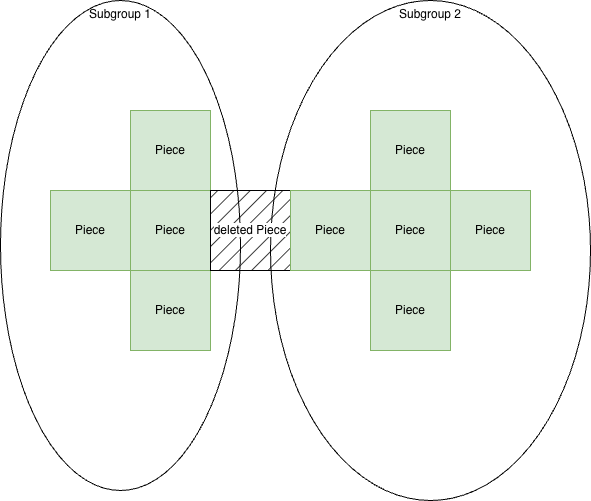
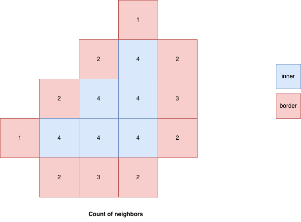

# Group Class Documentation

## Overview

The `Group` class represents a collection of connected puzzle pieces that move together as a single unit. The class ensures two critical invariants through neighbor-based algorithms:

1. **Connectivity**: All pieces in a group must form a connected graph
2. **Border Detection**: Pieces with incomplete neighbors are tracked as border pieces

## Core Concepts

### Neighbor Relationship

Two puzzle pieces are considered **neighbors** if they are adjacent in the puzzle grid. The system uses two methods to determine neighbor relationships:

1. **Grid-based**: Pieces at positions `(x, y)` and `(x±1, y)` or `(x, y±1)` are neighbors
2. **Spatial verification**: `gameTableController.arePiecesNeighbors()` validates actual proximity

### Data Structure

The Group maintains:
- **id**: Unique identifier string
- **pieces**: Immutable array of Piece objects
- **borderPieces**: Set of pieces with less than 4 neighbors

## Connectivity Monitoring

### Purpose

Connectivity monitoring ensures that all pieces in a group are reachable from any other piece through neighbor connections. This prevents disconnected piece clusters from being treated as a single group.

### Algorithm: arePiecesConnected()

**Implementation Strategy**: Graph-based connectivity check using the graphlib library.

**Process**:

1. **Trivial Cases**: 
   - Empty or single-piece groups are always connected
   
2. **Graph Construction**:
   - Each piece becomes a node in an undirected graph
   - Edges are created between neighboring pieces
   
3. **Neighbor Detection**:
   - First checks spatial proximity via game table controller
   - Falls back to grid position comparison
   - Two pieces are neighbors if adjacent in any cardinal direction
   
4. **Component Analysis**:
   - Uses `graphlib.alg.components()` to find connected components
   - Returns `true` if exactly one component exists

### Usage in Operations

**Construction**:
- By default, validates connectivity on group creation
- Can skip validation for deserialization with validateConnectivity option

**Adding Pieces**:
- Validates that new pieces maintain connectivity
- Throws error if connectivity would be violated

**Removing Pieces**:
- Returns new groups if removal causes fragmentation

### Fragmentation Handling

When pieces are removed, the system identifies disconnected subgroups:



1. The largest component remains in the current group
2. Smaller components are returned as new Group instances
3. Each fragment maintains its connectivity invariant

## Border Piece Determination



### Purpose

Border pieces are pieces that have fewer than 4 neighbors within the group. These pieces are important for:
- Collision detection during movement
- Connection attempts with other groups
- Visual feedback (e.g., highlighting connectable edges)

### Algorithm: _updateBorderPieces()

**Implementation Strategy**: Grid-based neighbor counting.

**Process**:

1. **Grid Map Construction**:
   - Builds a Map with "x,y" string keys for O(1) lookup
   - Maps grid positions to piece objects
   
2. **Neighbor Counting**:
   - For each piece, checks all 4 cardinal directions (north, east, south, west)
   - Counts how many neighboring positions contain pieces in the group
   
3. **Border Classification**:
   - Pieces with fewer than 4 neighbors are marked as border pieces
   - Interior pieces (4 neighbors) are not border pieces

### Performance Optimization

**Grid Map Lookup**: 
- Uses a Map with "x,y" keys for O(1) neighbor lookup
- Avoids O(n²) array scanning

**Time Complexity**:
- Building grid map: O(n) where n = number of pieces
- Checking neighbors: O(n) × 4 directions = O(n)
- **Total: O(n)**

### Border Piece Properties

A piece is classified as a border piece when it has fewer than 4 neighbors.

**Examples**:

```
Single piece:     Line of pieces:    Corner piece:
    [P]              [P][P][P]          [P][P]
neighborCount=0   middle piece=2      corner=2
                  end pieces=1        edge=3
```

**Complete Interior** (not a border piece):
```
    [P]
[P][P][P]
    [P]
neighborCount=4
```

### Access

Border pieces are accessed via the allBorderPieces getter, which returns a copy of the internal Set as an array, maintaining encapsulation.

### Update Triggers

Border pieces are automatically recalculated after:

1. **Construction** (if pieces exist)
2. **Adding pieces** (`addPieces()`)
3. **Removing pieces** (`removePieces()`)
4. **Clearing the group** (`clear()`)

## Neighbor-Based Algorithms Summary

### Connectivity Check
- **Input**: Array of pieces
- **Method**: Graph traversal (connected components)
- **Neighbor Test**: Spatial proximity + grid adjacency
- **Output**: Boolean (connected/disconnected)
- **Use Case**: Validation before modifications

### Border Detection
- **Input**: Current group pieces
- **Method**: Grid-based counting
- **Neighbor Test**: Grid position lookup (4 directions)
- **Output**: Set of border pieces
- **Use Case**: Connection opportunities, collision detection

### Key Differences

| Aspect | Connectivity Check | Border Detection |
|--------|-------------------|------------------|
| **Scope** | Inter-piece relationships | Per-piece analysis |
| **Algorithm** | Graph traversal | Grid counting |
| **Complexity** | O(n²) worst case | O(n) |
| **Validation** | Spatial + grid | Grid only |
| **Purpose** | Ensure group integrity | Find connection points |

## Integration Examples

### Checking Connection Opportunities
- Access border pieces via allBorderPieces getter
- Use border pieces to find connection candidates with nearby groups
- Border pieces represent potential attachment points

### Safe Group Merging
- Combine pieces from both groups into a single array
- Validate connectivity before merging
- Only merge if resulting group maintains connectivity

### Fragmentation Detection
- Remove pieces and check if new groups are returned
- Non-empty return indicates fragmentation occurred
- Register new fragment groups with the group manager

## Implementation Notes

### Immutability
The pieces array is treated as immutable:
- addPieces(): creates new array with spread operator
- removePieces(): creates new array with filter method

### Performance Considerations

**Border Updates**: O(n) operation, called after every modification
**Connectivity Checks**: O(n²) worst case, only validated on add/remove
**Spatial Index**: Delegates to `gameTableController` for actual proximity tests

### Error Handling

Connectivity violations throw descriptive errors indicating that the operation would result in a disconnected group.

## Dependencies

- **graphlib**: Graph data structure and algorithms
- **gameTableController**: Spatial proximity validation
- **Piece**: Grid coordinates (`gridX`, `gridY`) and neighbor methods
