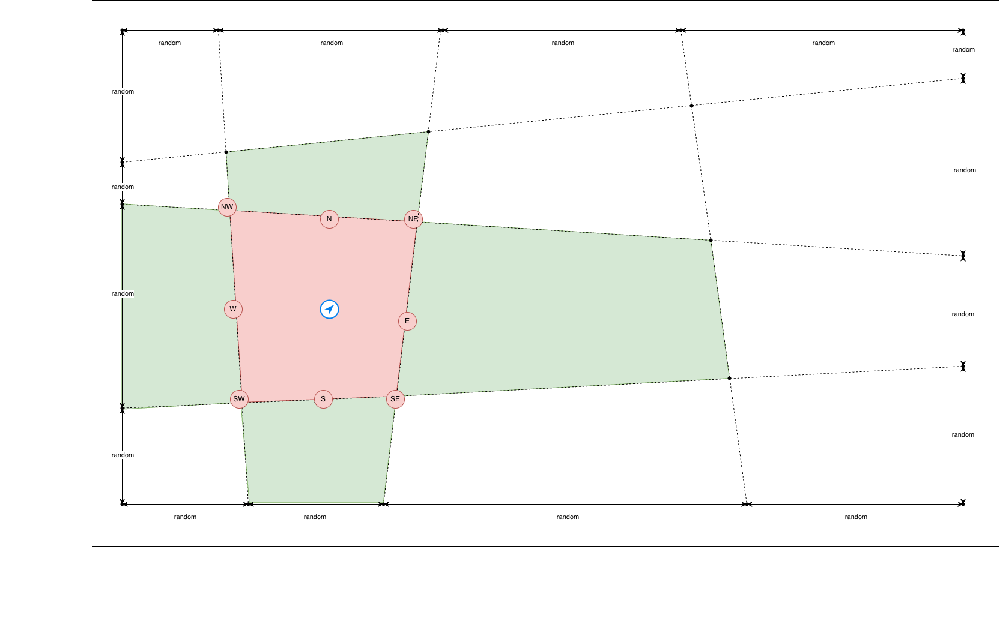
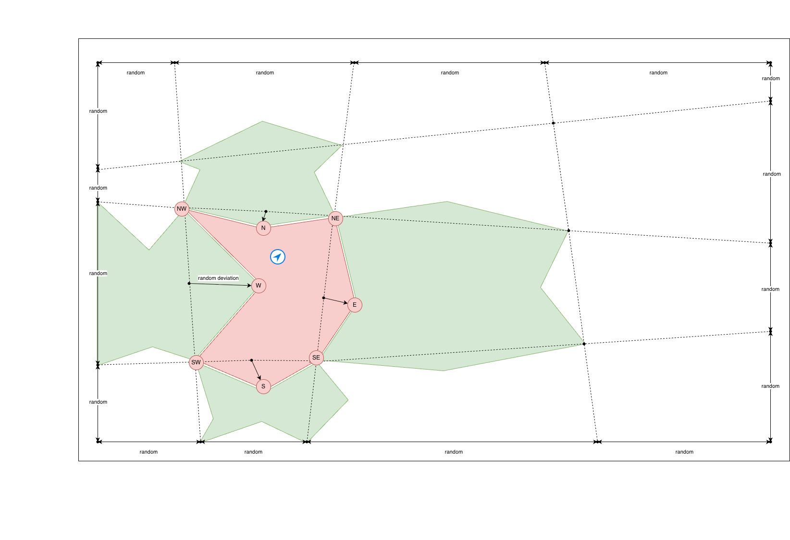

# Lattice Geometry Explained

## Overview

The `Lattice` class generates the geometric foundation for jigsaw puzzle pieces by creating a deformed grid of corner points and side waypoints. This document explains how the lattice geometry works and how it transforms a rectangular image into interlocking puzzle pieces.

## Core Concept

Instead of cutting an image into perfect rectangular pieces, we create a **randomized lattice** that defines where pieces connect. The lattice consists of:

1. **Corner Points** - Define the vertices where pieces meet
2. **Side Waypoints** - Define the knobs and dents (bumps and cavities) on piece edges

## The Three-Layer Structure

### 1. Random Cut Lines

The first step generates random "cut lines" that will slice through the image:

**Vertical Cuts** (for `cols-1` internal divisions):
- North points: Random positions along the top edge (y=0)
- South points: Random positions along the bottom edge (y=imgHeight)

**Horizontal Cuts** (for `rows-1` internal divisions):
- West points: Random positions along the left edge (x=0)  
- East points: Random positions along the right edge (x=imgWidth)

Each cut line is a **straight line** connecting two randomly positioned edge points. The irregular lattice pattern emerges from these straight lines having different slopes and intersecting at non-uniform angles.



#### How `splitSegment()` Works

For example, splitting width=1000 into 4 pieces (n=3 split points):
- Ideal positions: 250, 500, 750 (evenly spaced)
- Actual positions: 250±75, 500±75, 750±75 (randomized within ±30%)
- Result: 4 columns with varying widths

The randomization factor `CUT_RANDOMNESS_FACTOR = 0.3` means each split point can deviate by up to 30% of the average piece size, ensuring no cut line gets too close to image edges or other cuts.



### 2. Corner Lattice (Intersection Grid)

The corner lattice is built by calculating where cut lines intersect:

**Four Image Corners** (always exact):
```
(0, 0)                    (imgWidth, 0)
   +-------------------------+
   |                         |
   |                         |
   +-------------------------+
(0, imgHeight)      (imgWidth, imgHeight)
```

**Border Corners** (where cut lines meet image edges):
- Top edge: Where vertical cuts meet y=0 → use northPoints
- Bottom edge: Where vertical cuts meet y=imgHeight → use southPoints  
- Left edge: Where horizontal cuts meet x=0 → use westPoints
- Right edge: Where horizontal cuts meet x=imgWidth → use eastPoints

**Interior Corners** (where cut lines intersect):
- Each calculated using `calculateLineIntersection()`
- Example: Vertical cut from north[0] to south[0] intersects with horizontal cut from west[0] to east[0]

#### Line Intersection Mathematics

Given two lines defined by points (a,b) and (c,d), the intersection is calculated using the standard line intersection formula. The parameter `t` tells us how far along line AB the intersection occurs (0 = point a, 1 = point b). If the lines are parallel (denominator < 1e-10), the method returns null.

### 3. Side Waypoints (Knobs & Dents)

After corner positions are determined, we generate waypoints for the knobs/dents on each piece edge:

**Horizontal Internal Edges** (between rows):
- For each edge between corners[r+1][c] and corners[r+1][c+1]
- Create a waypoint using `deviatePoint()` to randomize position along the edge
- Offset perpendicular to create knob (+orientation) or dent (-orientation)

**Vertical Internal Edges** (between columns):
- For each edge between corners[r][c+1] and corners[r+1][c+1]
- Similar waypoint generation with perpendicular offset

#### Waypoint Generation with `deviatePoint()`

This method places the waypoint somewhere in the middle 50% of the edge (0.5 ± 0.25 = range [0.25, 0.75]), ensuring knobs/dents aren't too close to corners.

#### Knob/Dent Orientation

The `chooseOrientation()` method maintains a 50/50 balance:
- **KNOB (+1)**: Waypoint pushed outward (perpendicular to edge)
- **DENT (-1)**: Waypoint pushed inward (perpendicular to edge)

Using adaptive probability based on the ratio of needed positive orientations to remaining edges, this ensures roughly equal numbers of outward bumps and inward cavities across the entire puzzle.

## Key Constants

| Constant | Value | Purpose |
|----------|-------|---------|
| `CUT_RANDOMNESS_FACTOR` | 0.3 | Max deviation (±30%) for cut line positions |
| `WAYPOINT_OFFSET_RANGE` | 0.25 | Waypoint position range along edge (±25% from center) |
| `CAVITY_DEPTH_CAP_RELATIVE_TO_MIN` | 0.25 | Max cavity depth as fraction of min(pieceW, pieceH) |
| `CAVITY_DEPTH_CAP_EDGE_FRACTION` | 0.5 | Max cavity depth as fraction of edge length |
| `KNOB` | +1 | Outward bump polarity |
| `DENT` | -1 | Inward cavity polarity |

## Mathematical Properties

### No Clamping Required

The cut line positions naturally stay within image bounds because:
- Maximum deviation = `(length / (n+1)) × 0.3`
- For the last cut at position `c = cols-1`:
  - Ideal position: `(cols-1) × (imgWidth/cols)`
  - Max position: `(cols-1) × (imgWidth/cols) + 0.3 × (imgWidth/cols)`
  - Simplifies to: `(cols-0.7) × (imgWidth/cols)` 
  - Always less than `imgWidth`

### Balanced Knob/Dent Distribution

The adaptive probability formula ensures:
- As positive orientations fall behind target: bias increases → more KNOBs
- As positive orientations exceed target: bias decreases → more DENTs
- Final result: approximately 50% KNOB, 50% DENT across all internal edges

### Cavity Depth Control

Cavity (DENT) depth is clamped to prevent pieces from:
- Overlapping neighboring pieces
- Creating impossible geometry
- Having cavities deeper than the edge is long

The maximum depth is the minimum of: the requested depth, 25% of the smaller piece dimension, or 50% of the edge length.

## Connection to Piece Generation

The lattice provides the geometric data needed by `jigsaw-generator.js`:

1. **Piece Corners**: From `lattice.corners[r][c]` grid
2. **Piece Side Waypoints**: From `lattice.hSides[r][c]` and `lattice.vSides[r][c]`
3. **Path Generation**: `Lattice.createPiecePath()` connects corners and waypoints into a closed Path2D

Each puzzle piece is defined by:
- 4 corner points (from the lattice grid)
- 0-4 side waypoints (interior edges have knobs/dents, borders are flat)

## Implementation Notes

### Constructor Behavior

The constructor automatically:
1. Derives `pieceW = imgWidth / cols` and `pieceH = imgHeight / rows`
2. Builds the corner lattice via `buildCornerLattice()`
3. Generates internal edge waypoints via `generateInternalEdges()`
4. Stores results in `this.corners`, `this.hSides`, `this.vSides`

### Utility Functions

- **`splitSegment(length, n)`**: Generates n random split points along a segment
- **`calculateLineIntersection(a, b, c, d)`**: Finds where two lines intersect
- **`deviatePoint(a, b, range)`**: Finds random point between a and b with offset
- **`chooseOrientation()`**: Adaptively selects KNOB or DENT to maintain balance
- **`clampDepthForCavity(depth, edgeLength)`**: Prevents impossible cavity geometry

### Data Structures

**Corners**: 2D array `(rows+1) × (cols+1)` storing Point objects with x,y coordinates.

**Horizontal Sides**: 2D array `(rows-1) × cols` storing objects with waypoint position (x, y), orientation (KNOB or DENT), axis identifier ("h"), position along edge (tOffset), and cavity/bump depth.

**Vertical Sides**: 2D array `rows × (cols-1)` storing objects with waypoint position (x, y), orientation (KNOB or DENT), axis identifier ("v"), position along edge (tOffset), and cavity/bump depth.

## Advantages of This Approach

1. **Realistic Puzzle Appearance**: Wavy cut lines and randomized waypoints create authentic-looking pieces
2. **Perfect Interlocking**: Geometry guarantees pieces fit together exactly
3. **Efficient Computation**: Corner lattice calculated once, reused for all pieces
4. **Scalable**: Works for any image size and piece count
5. **No Overlap**: Mathematical constraints prevent impossible geometry
6. **Balanced Design**: Equal distribution of knobs and dents across puzzle

## Further Reading

- See `lattice.js` for the complete implementation
- See `jigsaw-generator.js` for how the lattice is used to create pieces
- See `GAME_SPECIFICATION.md` for the overall puzzle game design
