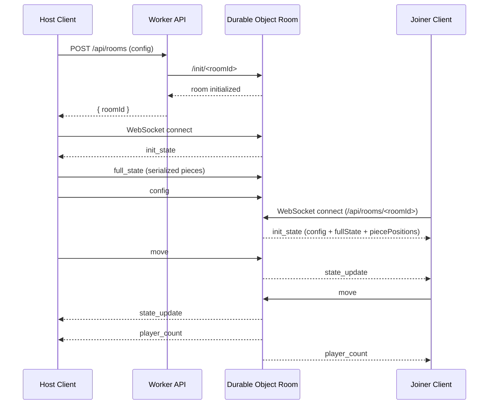

# Multiplayer Mode Architecture

This document explains how online multiplayer is structured in the puzzle project, from URL entry to real-time synchronization.

## 1. High-Level Design

The multiplayer implementation uses a client-server architecture:

- Client: browser app in `client/`
- Server: Cloudflare Worker + Durable Object in `server/`
- Transport: WebSocket for real-time updates, HTTP for room lifecycle
- Session model: authoritative room session state persisted in Durable Object storage

Core idea:

- The host creates a room and uploads puzzle configuration and full puzzle state.
- Joiners connect to the room and receive an `init_state` snapshot.
- During gameplay, clients send incremental piece movements.
- The server broadcasts updates to all other connected clients.

## 2. Main Components

### Client components

- `client/js/comm/online-game.js`
  - Orchestrates online mode startup for host and join flows.
  - Handles deferred initial sync (`pendingInitialSync`) until puzzle generation completes.

- `client/js/comm/network-manager.js`
  - Handles network lifecycle and protocol.
  - Opens WebSocket, sends/receives room messages, applies remote state updates.
  - Integrates with drag/connect/disconnect events.

- `client/js/app.js`
  - Bootstraps URL parsing and startup flow.
  - Runs `initOnlineMode(...)` based on `state.onlineMode`.
  - Reconstructs puzzle pieces from server snapshot for joiners.

- `client/js/utils/url-util.js`
  - Parses `?online=new` (host) and `?online=<roomId>` (join).

### Server components

- `server/src/worker.js`
  - HTTP API for room create/list/join routes.
  - CORS handling.
  - Durable Object class `PuzzleRoom` with WebSocket handling and persisted room session state.

- `server/src/shared/puzzle-session.js`
  - Room state helpers:
  - `createPuzzleSession`, `applyMove`, `applyFullState`, `applyConfig`, `createInitState`.

- `server/wrangler.toml`
  - Durable Object binding `PUZZLE_ROOM`.
  - KV namespace `ROOM_REGISTRY` for recent room metadata.

## 3. Runtime Modes

Multiplayer starts from URL params:

- Host mode: `?online=new`
  - `state.onlineMode = "host"`
  - A room is created via `POST /api/rooms`.

- Join mode: `?online=<roomId>`
  - `state.onlineMode = "join"`
  - Client connects directly to room WebSocket endpoint.

## 4. Room Lifecycle

### 4.1 Room creation

1. Host calls `startOnlineGame(config)`.
2. Client sends `POST /api/rooms` with image/puzzle config.
3. Worker creates a room ID and initializes the Durable Object session.
4. Worker optionally stores room metadata in KV (`ROOM_REGISTRY`) for recent rooms listing.
5. Host receives room ID and opens room WebSocket.

### 4.2 Room join

1. Joiner opens WebSocket to `/api/rooms/<roomId>`.
2. Durable Object accepts socket and returns `init_state`.
3. Joiner loads the image from `init_state.config.imageUrl`.
4. Joiner reconstructs full puzzle pieces from `init_state.pieces` when available.
5. Joiner applies latest positions from `init_state.piecePositions`.

### 4.3 Room expiration

- On room initialization, Durable Object sets an alarm for 1 hour.
- On alarm, connected sockets are closed and storage is cleared.

## 5. Data Model

Per-room server session structure (`createPuzzleSession`):

- `config`
  - `imageUrl`, `pieceCount`, `noRotate`, `removeColor`, `license`
- `pieces`
  - Map keyed by piece ID containing current movement state:
  - `x`, `y`, `rotation`, `groupId`, `zIndex`
- `fullState`
  - Full serialized piece array sent by host (includes geometry needed for deterministic reconstruction by joiners)

Why both `pieces` and `fullState` exist:

- `fullState` is needed so joiners can rebuild exact piece geometry.
- `pieces` tracks latest incremental movement state over time.

## 6. Wire Protocol

All WebSocket messages use JSON envelopes:

- Client to server: `{ type, data }`
- Server to client: `{ type, payload }`

Message types:

- `init_state` (server -> client)
  - Initial snapshot on connect.

- `move` (client -> server)
  - Incremental movement updates for one piece or a whole group.

- `state_update` (server -> other clients)
  - Broadcast of incoming `move` data.

- `full_state` (client -> server)
  - Host sends complete serialized puzzle state after puzzle generation/scatter.

- `config` (client -> server)
  - Config update payload.

- `config_update` (server -> clients)
  - Broadcast of latest room config.

- `player_count` (server -> clients)
  - Broadcast when users join/leave.

## 7. Synchronization Strategy

### 7.1 Initial synchronization

Host sends:

- `sendFullState()` once puzzle is ready.
- `sendConfig(...)` with current puzzle settings.

Joiners consume `init_state` and either:

- Reconstruct from `init_state.pieces` + apply `piecePositions`, or
- Fall back to local puzzle generation if no full state is available yet.

### 7.2 Incremental synchronization

Client emits movement updates on game events:

- `DRAG_END`: send moved piece/group position and orientation.
- `PIECES_CONNECTED`: send whole merged group state.
- `PIECES_DISCONNECTED`: send detached piece state.

### 7.3 Conflict handling

To avoid local drag jitter caused by remote updates, client keeps:

- `locallyDraggedPieces` set

During `state_update`, updates for pieces currently dragged locally are ignored.

Behavioral rule:

- Local interaction has temporary priority while dragging.
- Once drag ends, the piece is unmarked and future remote updates are accepted.

### 7.4 Group consistency

Remote updates may include `groupId` transitions.

Client-side logic in `network-manager.js`:

- Tracks pieces leaving old groups.
- Tracks pieces joining new groups.
- Rebuilds or updates group structures.
- Re-renders group visuals and positions after membership changes.

This keeps visual and logical grouping aligned across players.

## 8. HTTP API Surface

Implemented in `server/src/worker.js`:

- `GET /health`
  - Health endpoint.

- `GET /api/rooms`
  - Recent rooms list from KV registry.

- `POST /api/rooms`
  - Create room + initialize session with provided config.

- `GET /api/rooms/new`
  - Convenience room creation endpoint.

- `GET /api/rooms/<roomId>`
  - Room metadata when used as normal HTTP.

- `GET /api/rooms/<roomId>` with `Upgrade: websocket`
  - Real-time room channel.

## 9. End-to-End Flow (Sequence)

## 10. Design Tradeoffs

Current strengths:

- Simple protocol and straightforward client integration.
- Deterministic join flow because host can share full piece geometry.
- Durable Object persistence survives transient disconnects inside room lifetime.

Current limitations:

- No server-side conflict arbitration beyond last write distribution.
- No optimistic versioning or vector clocks for concurrent edits.
- Room expiration is fixed to 1 hour.
- No authentication layer on room access.

## 11. Related Files

- `client/js/comm/online-game.js`
- `client/js/comm/network-manager.js`
- `client/js/app.js`
- `client/js/utils/url-util.js`
- `server/src/worker.js`
- `server/src/shared/puzzle-session.js`
- `server/wrangler.toml`
