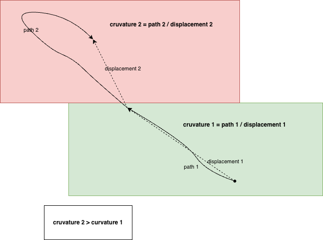

# Drag Curvature Gesture for Piece Detachment

## Overview

The puzzle game uses **path curvature analysis** to detect shuffle/shake gestures during piece dragging. This enables intuitive piece detachment from groups through a natural motion pattern, providing a device-independent alternative to keyboard modifiers or touch-specific gestures.

## What is Path Curvature?

Path curvature measures how "wiggly" or indirect a dragging motion is by comparing the total path length to the direct displacement:

```
Curvature = Total Path Length / Direct Displacement
```

### Curvature Values

- **1.0** - Perfectly straight line (direct drag)
- **1.5-2.5** - Gentle curve or corner turn
- **>3.5** - Shuffle/shake motion (triggers detachment)

## How It Works

### 1. Position Tracking

The `DragMonitor` class maintains a sliding window of the last 10 pointer positions during a drag operation. Each drag event updates this window with the current pointer coordinates and timestamp.

### 2. Curvature Calculation

For each new position, the system calculates:

1. **Total Path Length**: Sum of distances between consecutive points
   ```
   Σ √((x[i] - x[i-1])² + (y[i] - y[i-1])²)
   ```

2. **Direct Displacement**: Straight-line distance from first to last point
   ```
   √((x[last] - x[first])² + (y[last] - y[first])²)
   ```

3. **Curvature Ratio**: Total path divided by direct displacement

### 3. Gesture Detection

When curvature exceeds the threshold (default: 3.5), registered callbacks are triggered. The system uses a debouncing mechanism (100ms) to prevent multiple rapid triggers from the same gesture.

## Visual Example



The image shows the difference between:
- **Straight drag** with curvature ≈ 1.0 (direct path from start to end)
- **Shuffle motion** with curvature > 3.5 (back-and-forth movement creating a longer path)

## Implementation Details

### DragMonitor Class

Located in `js/interaction/drag.js`, the `DragMonitor` class provides:

- **Position Window**: Last 10 positions for curvature calculation
- **Real-time Analysis**: Updates curvature with each drag event
- **Callback System**: Threshold-based triggers with 100ms debouncing
- **Device Independence**: Works consistently across mouse, trackpad, and touch

### Key Methods

- `dragEvent(event)` - Process drag events and update curvature
- `registerCurvatureCallback(threshold, callback)` - Register gesture callbacks
- `endDrag()` - Reset on drag end
- `getCurvature()` - Get current curvature value
- `getStatistics()` - Get detailed metrics

## Advantages

### Device Independence
- **No pixel thresholds**: Works across different screen resolutions and DPI settings
- **Dimensionless metric**: Curvature ratio is resolution-independent
- **Universal input**: Same gesture works for mouse, trackpad, and touch

### User Experience
- **Natural motion**: Shake/shuffle is intuitive for "breaking apart"
- **No modifiers**: No need to hold Shift key or use multi-touch
- **Visual feedback**: Works well with visual drag effects
- **Mistake prevention**: Requires intentional motion, not accidental

### Technical Benefits
- **Simple algorithm**: Efficient O(n) calculation with small window
- **Low overhead**: Only 10 positions tracked, minimal memory
- **Robust detection**: Tolerant of speed variations and input noise
- **Configurable**: Threshold can be tuned for sensitivity

## Threshold Tuning

The default threshold of **3.5** provides good balance:

- **Lower values (2.0-3.0)**: More sensitive, may trigger on tight curves or corners
- **Higher values (4.0-5.0)**: Less sensitive, requires more pronounced shuffling
- **Recommended**: 3.5 works well for intentional shuffle gestures

## Integration with Game

### Piece Detachment Flow

1. User starts dragging a piece that's part of a group
2. User performs shuffle/shake motion (rapid back-and-forth)
3. Curvature exceeds threshold (3.5)
4. Callback triggers piece detachment
5. Piece becomes independent, can be moved freely
6. Visual feedback shows detachment occurred

### Alternative Methods

The curvature gesture complements other detachment methods:

- **Keyboard**: Hold Shift while dragging (desktop)
- **Touch**: Two-finger drag or long press (mobile)
- **Curvature**: Shuffle gesture (universal)

## Performance Considerations

- **Window Size**: 10 positions provides good balance of responsiveness and accuracy
- **Debouncing**: 100ms prevents multiple rapid triggers from same gesture
- **Calculation**: Simple distance formula, no complex math operations
- **Memory**: Minimal footprint (10 positions × 3 values = 30 numbers)

## Future Enhancements

Potential improvements to the curvature detection system:

1. **Adaptive Thresholds**: Adjust sensitivity based on device type or user preference
2. **Multi-gesture Support**: Detect other motion patterns (circles, figure-8)
3. **Velocity Analysis**: Combine curvature with acceleration for more complex gestures
4. **Visual Feedback**: Show curvature meter during drag for user awareness
5. **Gesture Recording**: Capture and replay gesture patterns for tutorials

## Testing

The `DragMonitor` class includes methods for testing and debugging. The `getStatistics()` method returns detailed metrics including current curvature, position window count, and active callback count. The `reset()` method clears all state for testing scenarios.

## References

- Implementation: `js/interaction/drag.js`
- Integration: `js/interaction/interaction-manager.js`
- Group Management: `js/model/group-manager.js`

---

**Note**: The curvature metric is a dimensionless ratio that works consistently across different devices, screen sizes, and input methods, making it ideal for cross-platform gesture detection.
